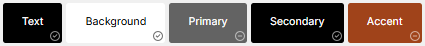

# Sprint 1 - A Working UI Prototype

## Sprint Goals

Develop a prototype that simulates the key functionality of the system, then test and refine it so that it can serve as the model for the next phase of development in Sprint 2.

[Figma](https://www.figma.com/) is used to develop the prototype.

---

## Initial Database Design

This is the first iteration of the planned database, done without much thought and to give a basis and idea of what to do

---

## UI 'Flow'

The first stage of prototyping was to explore how the UI might 'flow' between states, based on the required functionality.

This Figma demo shows the initial design for the UI 'flow':
there are 3 different initial designs all with different flow

1st:
 <iframe style="border: 1px solid rgba(0, 0, 0, 0.1);" width="380" height="600" src="https://embed.figma.com/proto/IlrMLwNlUWTdx1GqDgR2E4/Prototype-1?scaling=min-zoom&content-scaling=fixed&page-id=0%3A1&node-id=1-2&starting-point-node-id=1%3A2&embed-host=share" allowfullscreen></iframe>

2nd:
 <iframe style="border: 1px solid rgba(0, 0, 0, 0.1);" width="380" height="600" src="https://embed.figma.com/proto/St4EE3GtJU6dpXOuYWTuBT/Prototype-2?scaling=min-zoom&content-scaling=fixed&page-id=0%3A1&node-id=0-3&embed-host=share" allowfullscreen></iframe>

3rd:
 <iframe style="border: 1px solid rgba(0, 0, 0, 0.1);" width="400" height="800" src="https://embed.figma.com/proto/WUgYBRL0ROe14WUAclmIBV/Prototype-3?scaling=min-zoom&content-scaling=fixed&page-id=0%3A1&node-id=18-2&embed-host=share" allowfullscreen></iframe>

### Testing

I showed all 3 prototypes to the person who needs the site.
-
 > they said they liked prototype 3 the most because it was simpler and less info at a time and more pages with smaller parts of the form is easier to read and reduces stress load on end users.

 > they also mentioned a mistake i made, they told me that the field of timber grade   isnt necessary since it will nearly always be weatherboard.

### Changes / Improvements
Picked the 3rd Prototype to use

i went through and fixed the problems such as
- removed choose grade field from website, and removed it from the DB
- the chosen proto type didnt have any way for a person to find their document, the reason is because it needs to be discussed with with the person, because security may be a problem and they know what can and cant be done, so ill need further testing for that but for now ill add a basic one to give structure for the next step
- re-arranged db slightly, not very important
- new iteration:

    <iframe style="border: 1px solid rgba(0, 0, 0, 0.1);" width="380" height="600" src="https://embed.figma.com/proto/eaWi0R3FhUKeVAKvC3LMT6/Prototype-3-V2?node-id=18-2&p=f&scaling=min-zoom&content-scaling=fixed&page-id=0%3A1&embed-host=share" allowfullscreen></iframe>

 - new DB with grade field removed, also ordered it around differently:

## further testing

they said it was good, and there was nothing wrong with it

## Initial UI Prototype

The next stage of prototyping was to develop the layout for each screen of the UI.

This Figma demo shows the initial layout design for the UI:

<iframe style="border: 1px solid rgba(0, 0, 0, 0.1);" width="380" height="700" src="https://embed.figma.com/proto/tgiFFL1hWtBSQKogdKkLn1/Prototype-3-V3?scaling=min-zoom&content-scaling=fixed&page-id=0%3A1&node-id=18-2&embed-host=share" allowfullscreen></iframe>

## Refined UI Prototype

Having established the layout of the UI screens, the prototype was refined visually, in terms of colour, fonts, etc.

Colors:

- [Palette 1 Link](https://www.realtimecolors.com/?colors=ffffff-000000-232323-a14c1b-ffffff&fonts=Noto%20Sans%20Armenian-Noto%20Sans%20Armenian)

This Figma demo shows the UI with palette 1 applied:

<iframe style="border: 1px solid rgba(0, 0, 0, 0.1);" width="380" height="600" src="https://embed.figma.com/proto/FlM8Q6LMHsZ8o35ENzWCHd/Prototype-3-V4--color-?node-id=18-2&p=f&scaling=min-zoom&content-scaling=fixed&page-id=0%3A1&embed-host=share" allowfullscreen></iframe>

- [Palette 2 Link](https://www.realtimecolors.com/?colors=000000-ffffff-636363-000000-a0431a&fonts=Inter-Inter)

This Figma demo shows the UI with palette 2 applied:

<iframe style="border: 1px solid rgba(0, 0, 0, 0.1);" width="380" height="600" src="https://embed.figma.com/proto/nQdWs0flPkrQaNZSnDrDkR/Prototype-3-V4--color2-?node-id=18-2&p=f&scaling=min-zoom&content-scaling=fixed&page-id=0%3A1&embed-host=share" allowfullscreen></iframe>

### color check Testing

the black background is more of a unproffesional and fun color to use on a simple website - client

### Changes / Improvements

went with the white one for simplicity and the people using the website are more likely to find the white one to look better

### Final Testing

got two different people to try the figma design out and let them mess around with no guidance.

### Changes / Improvements

they did not run into any problems or get stuck. doesn't mean you cant get stuck though
they also were mostly able to understand what each option is / does.

---

## Sprint Review

this sprint allowed a staple point for the project to move forwards. It also gave a simple template as well as a refined one to work off of.

- getting test times for people to test the prototype sometimes took awhile.
- the coloration required a lot of thought to make it be cohesive with the brand logo and be aesthetically pleasing.
