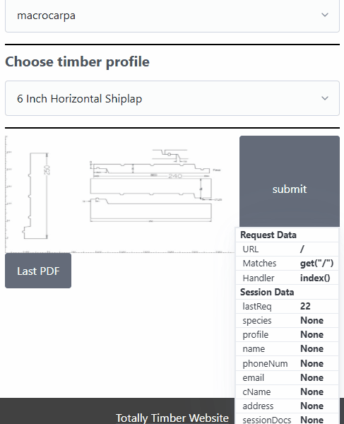

# Sprint 2 - A Minimum Viable Product (MVP)

## Sprint Goals

Develop a bare-bones, working web application that provides the key functionality of the system, then test and refine it so that it can serve as the basis for the final phase of development in Sprint 3.

---

## Implemented Database Schema

i removed unnecessary data to avoid clogging the db with unnecessary information. such as PDF - removed to stop massive blobs being added to the DB, now the PDF just regenerates of info in the DB using a lot less space.

---

## Initial Implementation

The key functionality of the web app was implemented:

---

## Testing form fields updating to session data

Making sure when the submit buttons is pressed for the first two pages it takes the inputted form data and stores it tempoarily to session data

I tested the wood page first, then i tested the details page.

### Changes / Improvements

the form functionally works well enough to not require unnecessary time consuming changes.

---

## Testing DB data to Flask page

I checked all the values in the db for all the current profiles data then aligned that against whats showing on the page

the values for reference...

drop down that displays the profiles entered

### Changes / Improvements

there was a problem where the image linked to the default profile (the first one to pop up when opening the page would display at all)

i implemented a quick fix that loads the default img on page startup

fix being applied ...

---

## Testing session data to database data

Replace this text with notes about what you are testing, how you tested it, and the outcome of the testing

**PLACE SCREENSHOTS AND/OR ANIMATED GIFS OF THE TESTING HERE**

### Changes / Improvements

Replace this text with notes any improvements you made as a result of the testing.

**PLACE SCREENSHOTS AND/OR ANIMATED GIFS OF THE IMPROVED SYSTEM HERE**

---

## Testing FEATURE NAME HERE

Replace this text with notes about what you are testing, how you tested it, and the outcome of the testing

**PLACE SCREENSHOTS AND/OR ANIMATED GIFS OF THE TESTING HERE**

### Changes / Improvements

Replace this text with notes any improvements you made as a result of the testing.

**PLACE SCREENSHOTS AND/OR ANIMATED GIFS OF THE IMPROVED SYSTEM HERE**

---

## Testing FEATURE NAME HERE

Replace this text with notes about what you are testing, how you tested it, and the outcome of the testing

**PLACE SCREENSHOTS AND/OR ANIMATED GIFS OF THE TESTING HERE**

### Changes / Improvements

Replace this text with notes any improvements you made as a result of the testing.

**PLACE SCREENSHOTS AND/OR ANIMATED GIFS OF THE IMPROVED SYSTEM HERE**

---

## Sprint Review

Replace this text with a statement about how the sprint has moved the project forward - key success point, any things that didn't go so well, etc.

